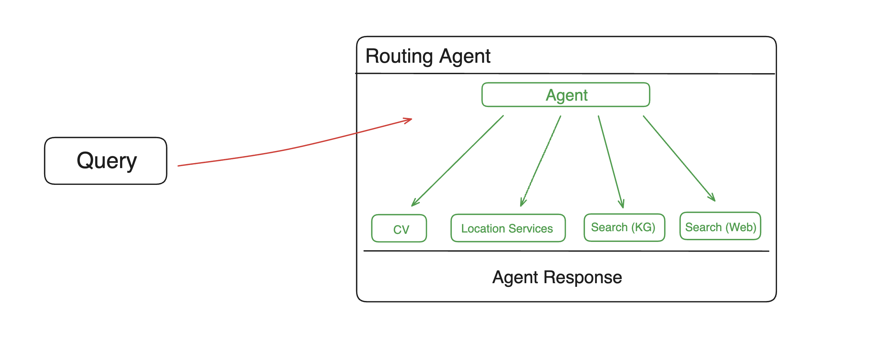
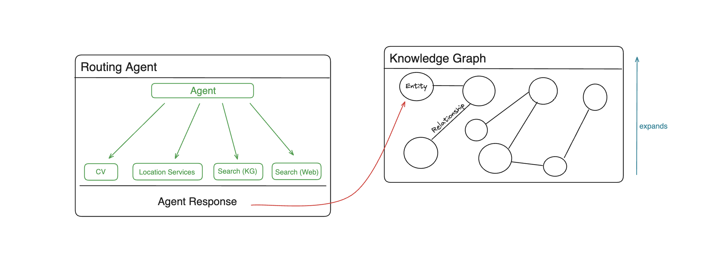
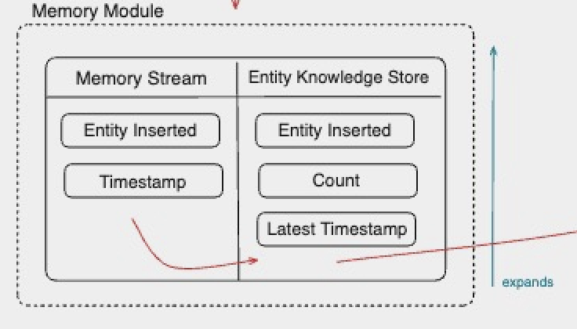

# Overview
## General
Longterm memory for autonomous agents. Overcoming finite context windows. 

The current structure of memary is detailed in the diagram below.


The above process includes the routing agent, knoweldge graph and memory module are all integrated into the `ChatAgent` class located in the `src/agent` directory.

Raw source code for these components can also be found in their respective directories including benchmarks, notebooks, and updates.

## Installation
1. Create your [virtual environment](https://packaging.python.org/en/latest/guides/installing-using-pip-and-virtual-environments/#create-and-use-virtual-environments) and activate it
2. Install Python dependencies:
   ```
   pip install -r requirements.txt
   ```

## Demo
To run the Streamlit app: 
1. Ensure that a `.env` exists with necessary API keys and Neo4j credentials. 
2. Run:
   ```
   streamlit run streamlit_app/app.py
   ```

## Detailed Component Breakdown
### Routing Agent

- Uses the [ReAct agent](https://react-lm.github.io/) model to return a response based on the tools that are provided. This type of agent has the ability to reason over which of the tools to use next to further the response, feed inputs into the selected tool and repeat the process with the output until it determines that the answer is satisfactory. 
- What is the purpose?
  - The agent is able to make decisions on which tools to use and in which order taking into account different dependencies and purposes of substeps in order to create the most suitable response based on the tools available to the agent.
- Current tool suite:
  - **Location** - determines the current location of the user using geocoder and googlemaps
  - **CV** - answers a query based on a provided image using gpt-4-vision-preview
  - **Search** - queries the knowledge graph for a response based on existing nodes, and executes an external search if no related entities exist
- How does it work?
  - Takes in each query &rarr; selects a tool &rarr; executes and finds an answer to current step &rarr; repeats this process until it reaches a satisfactory answer
- Purpose of larger system
  - Decides which tools to use based on subqueries. Passes all responses to the reranking module (one response for each subquery) 
- Future contributions
  - Make your own agent! Add as many tools as possible! Each tool is an expansion of the agent's ability to answer a wide variety of queries.
  - Create a LLM Judge that scores the routing agent and provides feedback 

### Knowledge Graph

- What are knowledge graphs?
  - Knowledge graphs are databases that store information in the form of entities, which can be anything from objects to more abstract concepts, and their relationships with one another.
- Knowledge graphs vs other knowledge stores
  - KGs provide more depth of the highly necessary context that the retrieved information must have
  - Graph structure of the knowledge store allows information to be centered around certain entities and their relationships with other entities, thus ensuring that the context of the information is relevant
  -  more adept handling of complexity in queries as varying relationships between different entities in the query can provide insight into joining multiple topics
-  Knowledge graphs &harr; LLMs
   -  memary uses a Neo4j graph database to store knoweldge
   -  LLamaindex was used for adding nodes into the graph store based on documents
   -  Perplexity (mistral-7b-instruct model) was used for external queries
-  What can one do with the KG?
   -  Inject the final response from the routing agent into existing KGs
   -  memary uses a [recursive retrieval](https://arxiv.org/pdf/2401.18059.pdf) approach to search the KG which involves determining what the key entities are in the query, building a subgraph of those entities with a maximum depth of 2 away, and finally using that subgraph to build up context
   -  When faced with multiple key entities in a query, memary uses [multi-hop](https://neo4j.com/developer-blog/knowledge-graphs-llms-multi-hop-question-answering/) reasoning to join multiple subgraphs into a larger subgraph to search through
   -  These techniqeus reduce latency when compared to searching the entire knowledge graph at once
-  Purpose in larger system
   -  Continuously update the memory module with each node insertion
-  Future contributions
   -  Expand graph’s capabilities to support multiple modalities
   -  Graph optimizations to reduce latency of search times

### Memory Module

- What is the memory module? 
    - Memory Stream (Breadth of user knowledge) that captures all entities involved in conversations, including questions, answers, and their timestamps.
      1. Identify Key Entities: Extract the most frequently mentioned entities or those tied to the most significant interactions. This could be based on direct mentions, relevance to the user's stated preferences or needs, or frequency of occurrence.
      2. Timeline Analysis: Map out a timeline of interactions, highlighting moments of high engagement or shifts in topic focus. This helps in understanding the evolution of the user's interests or concerns over time.
      3. Extract Themes: Look for recurring themes or topics within the interactions. This thematic analysis can help in anticipating user interests or questions even before they are explicitly stated.
    - Entity Knowledge Store (Depth of user knowledge) that tracks the frequency and recency of references to each entity.
      1. Rank Entities by Relevance: Use both frequency and recency to rank entities in terms of current relevance to the user. An entity frequently mentioned and referenced recently is likely of high importance.
      2. Categorize Entities: Group entities into categories based on their nature or the context in which they're mentioned (e.g., technical terms, personal interests). This categorization aids in quickly accessing relevant information tailored to the user's inquiries.
      3. Highlight Changes Over Time: Identify any significant changes in the entities' ranking or categorization over time. A shift in the most frequently mentioned entities could indicate a change in the user's interests or needs.
- Purpose in larger system
  - Compress/summarize certain info in the memory stream & entity knowledge store (related to query) and pass to the LLM’s finite context window alongside the reranked response for inference to provide the user a familiar/personalized response.
  - Personalize Responses: Use the key entities and themes identified to tailor your responses more closely to the user's current interests and historical context.
  - Anticipate Needs: Leverage trends and shifts identified in the summaries to anticipate the user's future questions or needs, providing proactive and insightful responses.
  - Maintain Contextual Relevance: Ensure that responses are not only personalized but also contextually relevant by aligning with the most recent and frequent entities and themes.

## Future Integrations
The source code for several other components that are not yet integrated into the main `ChatAgent` class. These include query decompostion and reranking. The diagram below shows what how the newly integrated system would work.


### Query decomposition
- What is query decomposition?
  - LLM preprocessing technique that breaks down advanced queries into simpler queries to expedite the LLM’s ability to answer the prompt. It is important to note that this process leaves simple queries unchanged.
- Why decompose?
  - User queries are complex and multifaceted, and base-model LLMs are often unable to fully understand all aspects of the query in order to create a succinct and accurate response.
  - Allows the same LLM to answer easier questions, and synthesize those answers to output a much better response.
- How it works
  - Initially, a LlamaIndex fine tuned query engine approach was taken. However, a LangChain query engine was found to be faster and easier to use. LangChain’s `PydanticToolsParser` framework was used. The query_engine_with_examples has been given 87 pre-decomposed queries (complex query + set of subqueries) to determine a pattern. Users can invoke the engine with individual queries, or collate them into a list and invoke by batch. 
- Purpose in larger system
  - In a parallel system, the Routing Agent will be able to parse multiple queries at once. The query decomposer will pass all subqueries (or original query if no subqueries exist) to the Routing Agent at once.
  - Simultaneously, the query decomposer will pass the original query to the reranker to allow it to optimize the output from the routing agent
- Future contributions
  - When multiprocessing system is provided, QD will be integrated. All inputted queries will be passed to QD, and the proper (sub)queries wil be passed to the routing agent for parallel processing.
  - Self-Learning: Whenever queries are decomposed properly, those examples will be appended to the engine’s example store for it to improve itself.

### Reranking